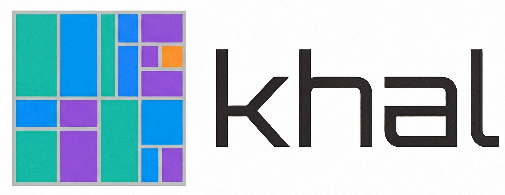
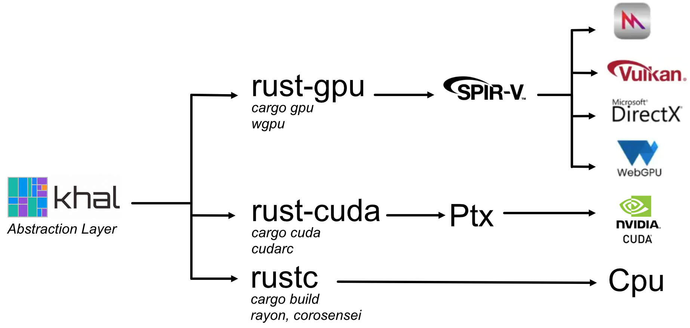

# khal - Cross-platform abstractions for compute shaders

<p align="center">
  
</p>
<p align="center">
    <a href="https://discord.gg/vt9DJSW">
        
    </a>
</p>

**KHAL** (Kompute Hardware Abstraction Layer) lets you write compute shaders in Rust and run them
on any platform: **WebGPU**, **CUDA**, or **CPU** -- from a single codebase.

> **Warning**
> KHAL is still under heavy development. The CUDA backend is currently only supported when using the
> github version of `khal-std` (because some dependencies are not available on cartes.io yet). If you
> don’t intend to target cuda, then the published version of `khal-std` is the way to go.

<p align="center">
  
</p>

## Features

- **Write once, run anywhere** -- the same shader code compiles to SPIR-V (WebGPU/Vulkan), PTX (CUDA), and native CPU.
- **Proc-macro bindings** -- `#[spirv_bindgen]` generates type-safe host-side structs from your shader function signature.
- **Build pipeline** -- `khal-builder` orchestrates `cargo gpu` and `cargo cuda` to compile shaders at build time.

## Development setup

### cargo-gpu (required for SPIR-V / WebGPU)

Install `cargo-gpu` from crates.io:

```bash
cargo install cargo-gpu --version 0.10.0-alpha.1
cargo gpu install
```

### cargo-cuda (required for CUDA / PTX)

Install `cargo-cuda` from crates.io:

```bash
cargo install cargo-cuda --version 0.1.0
cargo cuda install
```

This requires the **CUDA toolkit** to be installed and the `CUDA_PATH` environment variable to
point to it (e.g. `/usr/local/cuda`). The install step downloads a pinned Rust nightly, adds the
`nvptx64-nvidia-cuda` target, and compiles the codegen backend.

## Crates

| Crate | Description |
|-------|-------------|
| `khal` | Core backend abstraction (`Backend`, `Encoder`, `Buffer`, `Dispatch` traits) |
| `khal-std` | GPU standard library (atomics, sync, iteration, math via `glamx`) |
| `khal-derive` | Proc-macros: `#[derive(Shader)]`, `#[derive(ShaderArgs)]`, `#[spirv_bindgen]` |
| `khal-builder` | Build-time shader compilation orchestrator (SPIR-V + PTX) |
| `cargo-cuda` | CLI tool for compiling Rust shaders to PTX via `rustc_codegen_nvvm` |

## Backends

| Backend | Feature flag | Shader format | Notes |
|---------|-------------|---------------|-------|
| WebGPU  | `webgpu` (default) | SPIR-V | Cross-platform via wgpu |
| CUDA    | `cuda` | PTX | NVIDIA GPUs, requires CUDA toolkit |
| CPU     | `cpu` | Native | Single-threaded; use `cpu-parallel` for rayon-based dispatch |


## Example

Define a shader kernel (in a shader crate):

```rust
use khal_std::glamx::UVec3;
use khal_std::macros::{spirv, spirv_bindgen};

#[spirv_bindgen]
#[spirv(compute(threads(64)))]
pub fn add_assign(
    #[spirv(global_invocation_id)] invocation_id: UVec3,
    #[spirv(storage_buffer, descriptor_set = 0, binding = 0)] a: &mut [f32],
    #[spirv(storage_buffer, descriptor_set = 0, binding = 1)] b: &[f32],
) {
    let tid = invocation_id.x as usize;
    if tid < a.len() {
        a[tid] += b[tid];
    }
}
```

Then dispatch it from the host:

```rust
use khal::backend::{Backend, Buffer, Encoder, GpuBackend, WebGpu};
use khal::{BufferUsages, Shader};

#[derive(Shader)]
pub struct GpuKernels {
    add_assign: AddAssign, // generated by #[spirv_bindgen]
}

let backend = GpuBackend::WebGpu(WebGpu::default().await?);
let kernels = GpuKernels::from_backend(&backend)?;

let mut a = backend.init_buffer(&a_data, BufferUsages::STORAGE | BufferUsages::COPY_SRC)?;
let b = backend.init_buffer(&b_data, BufferUsages::STORAGE)?;

let mut encoder = backend.begin_encoding();
let mut pass = encoder.begin_pass("add_assign", None);
kernels.add_assign.call(&mut pass, a.len(), &mut a, &b)?;
drop(pass);
backend.submit(encoder)?;

let result = backend.slow_read_vec(&a).await?;
```
