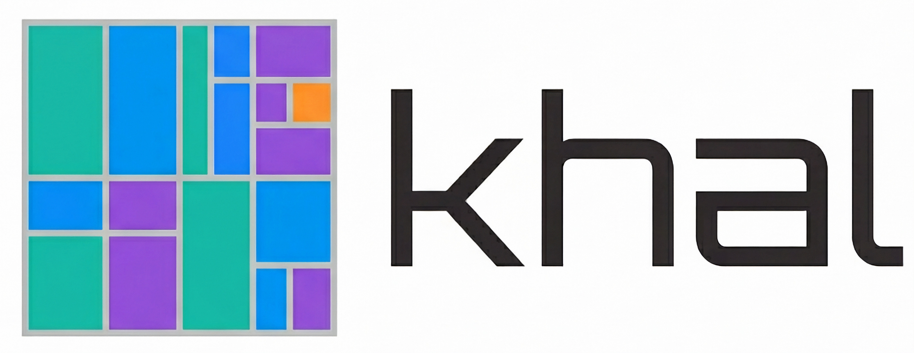
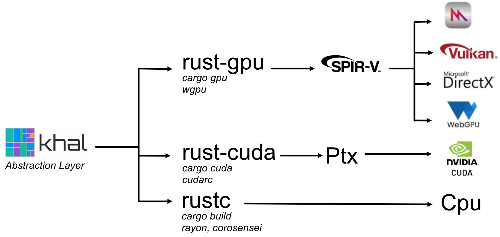

# khal - Cross-platform abstractions for compute shaders

<p align="center">
  
</p>
<p align="center">
    <a href="https://discord.gg/vt9DJSW">
        
    </a>
</p>

**KHAL** (Kompute Hardware Abstraction Layer) lets you write compute shaders in Rust and run them
on any platform: **WebGPU**, **CUDA**, or **CPU** -- from a single codebase.

> **Warning**
> KHAL is still under heavy development. The CUDA backend is currently only supported when using the
> github version of `khal-std` (because some dependencies are not available on cartes.io yet). If you
> don’t intend to target cuda, then the published version of `khal-std` is the way to go.

<p align="center">
  
</p>

## Features

- **Write once, run anywhere** -- the same shader code compiles to SPIR-V (WebGPU/Vulkan), PTX (CUDA), and native CPU.
- **Proc-macro bindings** -- `#[spirv_bindgen]` generates type-safe host-side structs from your shader function signature.
- **Build pipeline** -- `khal-builder` orchestrates `cargo gpu` and `cargo cuda` to compile shaders at build time.

## Development setup

### cargo-gpu (required for SPIR-V / WebGPU)

Install `cargo-gpu` from crates.io:

```bash
cargo install cargo-gpu --version 0.10.0-alpha.1
cargo gpu install
```

### cargo-cuda (required for CUDA / PTX)

Install `cargo-cuda` from crates.io:

```bash
cargo install cargo-cuda --version 0.1.0
cargo cuda install
```

This requires the **CUDA toolkit** to be installed and the `CUDA_PATH` environment variable to
point to it (e.g. `/usr/local/cuda`). The install step downloads a pinned Rust nightly, adds the
`nvptx64-nvidia-cuda` target, and compiles the codegen backend.

Compiling that backend (`rustc_codegen_nvvm`) needs a few system packages besides the toolkit:
`pkg-config` and `libssl-dev` (for its `openssl-sys` dependency), and libclang with its resource
headers for `bindgen` (`libclang-common-21-dev`, or `clang-21`, on Debian/Ubuntu; otherwise the
libNVVM bindings fail with `'stddef.h' file not found`).

It also needs **LLVM 7.1.0** (libNVVM only accepts LLVM 7 bitcode). Rust-CUDA ships no prebuilt
LLVM for Linux, so build it once from source and point `LLVM_CONFIG` at it. Distro packages no
longer exist for LLVM 7; this is the recipe from Rust-CUDA's own Dockerfiles (cmake 3.x is required,
cmake 4 rejects LLVM 7's old policy settings, and GCC 15 builds it cleanly):

```bash
curl -sSfLO https://github.com/llvm/llvm-project/releases/download/llvmorg-7.1.0/llvm-7.1.0.src.tar.xz && tar -xf llvm-7.1.0.src.tar.xz && mkdir llvm-7.1.0.src/build && cd llvm-7.1.0.src/build && cmake -G Ninja -DCMAKE_BUILD_TYPE=Release -DLLVM_TARGETS_TO_BUILD="X86;NVPTX" -DLLVM_BUILD_LLVM_DYLIB=ON -DLLVM_LINK_LLVM_DYLIB=ON -DLLVM_ENABLE_ASSERTIONS=OFF -DLLVM_ENABLE_BINDINGS=OFF -DLLVM_INCLUDE_EXAMPLES=OFF -DLLVM_INCLUDE_TESTS=OFF -DLLVM_INCLUDE_BENCHMARKS=OFF -DLLVM_INCLUDE_DOCS=OFF -DLLVM_ENABLE_ZLIB=OFF -DLLVM_ENABLE_TERMINFO=OFF -DLLVM_ENABLE_LIBXML2=OFF -DLLVM_ENABLE_LIBEDIT=OFF -DCMAKE_INSTALL_PREFIX=$HOME/llvm-7 .. && ninja && ninja install
```

```bash
LLVM_CONFIG=$HOME/llvm-7/bin/llvm-config cargo cuda install
```

### cargo-oxide (alternative CUDA / PTX compiler)

The `cuda-oxide` feature compiles the kernels with [cuda-oxide](https://github.com/NVlabs/cuda-oxide)
(NVIDIA's LLVM 21 based Rust → PTX backend) instead of `cargo-cuda`. The shader crate is then built
as an ordinary host-target crate and the cuda-oxide codegen backend intercepts the kernel entries.

Requirements:

- The **CUDA toolkit** (12.8+) on `PATH`, with `CUDA_HOME` pointing at it (e.g. `/usr/local/cuda`).
  `nvcc` must be on `PATH` for `cudarc`'s build script, and `CUDA_HOME` is how cuda-oxide finds
  libdevice, libnvvm and nvJitLink.
- `libffi-dev` (Debian/Ubuntu package name). cuda-oxide's codegen backend is a dylib linked against
  rustc's `librustc_driver`, which needs libffi at link time.
- The Rust nightly pinned by cuda-oxide's `rust-toolchain.toml` (currently `nightly-2026-04-03`),
  with the `rust-src`, `rustc-dev` and `llvm-tools` components. cuda-oxide is a rustc codegen
  backend linked against that exact toolchain, so build everything with `cargo +<that nightly>`.
- `cargo-oxide`, installed from the same cuda-oxide revision that `khal-std` pins its `cuda-device`
  dependency to (see `crates/khal-std/Cargo.toml`):

```bash
cargo +nightly-2026-04-03 install --git https://github.com/NVlabs/cuda-oxide.git --rev 62472763 cargo-oxide
```

On first use `cargo-oxide` clones cuda-oxide into `~/.cargo/cuda-oxide/src` and builds the codegen
backend from it (several minutes). To keep that clone on the pinned revision as well:

```bash
git clone https://github.com/NVlabs/cuda-oxide.git ~/.cargo/cuda-oxide/src && git -C ~/.cargo/cuda-oxide/src checkout 62472763
```

Then, for the example:

```bash
cargo +nightly-2026-04-03 run --bin khal-example --features cuda-oxide
```

`khal-builder` targets the local GPU's compute capability (via `nvidia-smi`); set `KHAL_CUDA_ARCH=sm_XX`
(or `CUDA_OXIDE_TARGET=sm_XX`) to override it. A prebuilt PTX/cubin can be embedded instead of compiling
by setting `CUDA_OXIDE_SHADERS_PTX_<SHADER_CRATE_NAME>` to its path.

### Indirect dispatch on CUDA

CUDA has no device-side indirect launch. Rather than reading the workgroup count back to the host
before every indirect dispatch (a full stream drain each time), the CUDA backend launches a fixed
number of resident blocks (`multiprocessor count × 16`, override with `KHAL_CUDA_PERSISTENT_BLOCKS`)
and the kernel entries generated by `#[spirv_bindgen]` loop over the *virtual* workgroups read from
the indirect-args buffer on the device. Direct dispatches run exactly one iteration per block, and the
loop count is uniform per block so workgroup barriers stay valid. `KHAL_CUDA_INDIRECT_SYNC=1` restores
the synchronous host readback for debugging.

### CUDA graphs

`GpuBackend::begin_capture()` / `end_capture()` record every dispatch and copy issued in between into a
`GpuGraph` that `launch()` replays with a single driver call (CUDA only; other backends return
`GpuBackendError::Unsupported`). The captured region must be replay-safe: no buffer allocation, no host
readback or synchronization, no upload from pageable host memory, and host-side control flow is frozen
at capture time. nexus uses this to replay a whole physics frame (`NEXUS_CUDA_GRAPHS=1`, or the
"CUDA graphs" checkbox / `--cuda-graphs` flag of its testbed).

### PTX vs. cubin

With either compiler, `khal-builder` then assembles the PTX into a **cubin** for the local GPU using the
toolkit's `ptxas` when it can find it (`PATH`, `CUDA_HOME`, `CUDA_PATH`, `/usr/local/cuda`). The driver
otherwise JIT-compiles the PTX at load time and rejects PTX whose ISA version is newer than the driver
supports (`CUDA_ERROR_UNSUPPORTED_PTX_VERSION`, typically a toolkit newer than the driver, e.g. 13.3 vs
13.2). A cubin sidesteps that and skips the JIT. Set `KHAL_CUDA_KEEP_PTX=1` to keep forward-compatible
PTX text instead (e.g. when shipping a binary to machines with other GPUs).

## Crates

| Crate | Description |
|-------|-------------|
| `khal` | Core backend abstraction (`Backend`, `Encoder`, `Buffer`, `Dispatch` traits) |
| `khal-std` | GPU standard library (atomics, sync, iteration, math via `glamx`) |
| `khal-derive` | Proc-macros: `#[derive(Shader)]`, `#[derive(ShaderArgs)]`, `#[spirv_bindgen]` |
| `khal-builder` | Build-time shader compilation orchestrator (SPIR-V + PTX) |
| `cargo-cuda` | CLI tool for compiling Rust shaders to PTX via `rustc_codegen_nvvm` |

## Backends

| Backend | Feature flag | Shader format | Notes |
|---------|-------------|---------------|-------|
| WebGPU  | `webgpu` (default) | SPIR-V | Cross-platform via wgpu |
| CUDA    | `cuda` | PTX | NVIDIA GPUs, requires CUDA toolkit; kernels compiled by `cargo-cuda` |
| CUDA    | `cuda-oxide` | PTX | Same runtime as `cuda`; kernels compiled by `cargo-oxide` instead |
| CPU     | `cpu` | Native | Single-threaded; use `cpu-parallel` for rayon-based dispatch |


## Example

Define a shader kernel (in a shader crate):

```rust
use khal_std::glamx::UVec3;
use khal_std::macros::{spirv, spirv_bindgen};

#[spirv_bindgen]
#[spirv(compute(threads(64)))]
pub fn add_assign(
    #[spirv(global_invocation_id)] invocation_id: UVec3,
    #[spirv(storage_buffer, descriptor_set = 0, binding = 0)] a: &mut [f32],
    #[spirv(storage_buffer, descriptor_set = 0, binding = 1)] b: &[f32],
) {
    let tid = invocation_id.x as usize;
    if tid < a.len() {
        a[tid] += b[tid];
    }
}
```

Then dispatch it from the host:

```rust
use khal::backend::{Backend, Buffer, Encoder, GpuBackend, WebGpu};
use khal::{BufferUsages, Shader};

#[derive(Shader)]
pub struct GpuKernels {
    add_assign: AddAssign, // generated by #[spirv_bindgen]
}

let backend = GpuBackend::WebGpu(WebGpu::default().await?);
let kernels = GpuKernels::from_backend(&backend)?;

let mut a = backend.init_buffer(&a_data, BufferUsages::STORAGE | BufferUsages::COPY_SRC)?;
let b = backend.init_buffer(&b_data, BufferUsages::STORAGE)?;

let mut encoder = backend.begin_encoding();
let mut pass = encoder.begin_pass("add_assign", None);
kernels.add_assign.call(&mut pass, a.len(), &mut a, &b)?;
drop(pass);
backend.submit(encoder)?;

let result = backend.slow_read_vec(&a).await?;
```
